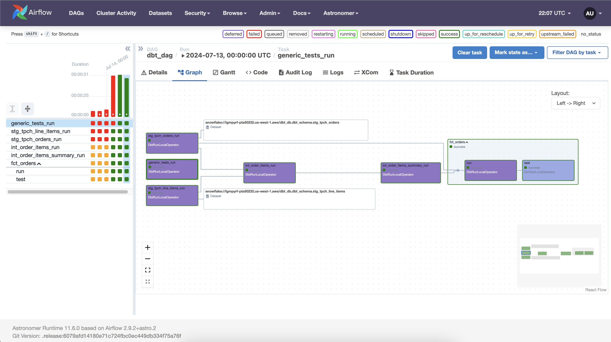

# ELT-with-dbt-Snowflake-Airflow
ELT with dbt, Snowflake, Airflow





# Setup Python Virtual Environment

    python -m venv myenv
    source myenv/bin/activate
    pip install -r requirements.txt

# Steps
    1. Setup Snowflake environment
    2. Configure dbt_profile.yml
    3. Create source and staging files
    4. Macros (DRY Principle)
    5. Transform models (facts, tables, data marts)
    6. Generic and Singular Tests
    7. Deploy on Airflow


# Step 1: Setup snowflake environment

    -- create accounts
    use role accountadmin;

    create warehouse dbt_wh with warehouse_size='x-small';
    create database if not exists dbt_db;
    create role if not exists dbt_role;

    show grants on warehouse dbt_wh;

    grant role dbt_role to user [snowflake_user];
    grant usage on warehouse dbt_wh to role dbt_role;
    grant all on database dbt_db to role dbt_role;
    grant all on schema dbt_schema to role dbt_role;

    use role dbt_role;

    create schema if not exists dbt_db.dbt_schema;

    use dbt_db;
    use warehouse dbt_wh;

    use role securityadmin;

    grant MANAGE GRANTS on account to role dbt_role;

    use role dbt_role;

    grant select on future tables in schema dbt_db.dbt_schema to role dbt_role; -- this works

    use schema dbt_schema

    select * from STG_TPCH_ORDERS limit 3;

    
    -- clean up
    use role accountadmin;

    drop warehouse if exists dbt_wh;
    drop database if exists dbt_db;
    drop role if exists dbt_role;

# dbt init

    dbt init
    snowflake
    Which database would you like to use? snowflake

    (Don't see the one you want? https://docs.getdbt.com/docs/available-adapters)

    Enter a number: 1
    account (https://<this_value>.snowflakecomputing.com): xxxxx.xxxxx
    user (dev username): [yourlogin]
    [1] password
    [2] keypair
    [3] sso
    Desired authentication type option (enter a number): 1
    password (dev password): 
    role (dev role): dbt_role
    warehouse (warehouse name): dbt_wh
    database (default database that dbt will build objects in): dbt_db
    schema (default schema that dbt will build objects in): dbt_schema
    threads (1 or more) [1]: 10

    cd data_pipeline
    dbt debug

# configure dbt_project.yml

    models:
    data_pipeline: 
        # Config indicated by + and applies to all files under models/example/
        staging:
        +materialized: view
        snowflake_wharehouse: dbt_wh
        marts:
        +materialized: table
        snowflake_warehouse: dbt_wh

# install dbt dependencies in packages.yml. get latest dbt-utils

    dbt deps

# dbt run

    dbt run

# dbt run specific model only
    dbt run -s stg_tpch_line_items 

# dbt test

    dbt test

# Deployment with Apache Airflow and Cosmos

    brew install astro
    mkdir dbt-dag
    cd dbt-dag
    astro dev init
    astro dev start

# Update Dockerfile in Cosmos

    RUN python -m venv dbt_venv && source dbt_venv/bin/activate && \
        pip install --no-cache-dir dbt-snowflake && deactivate


# Airflow Snowflake Connections: Admin -> Connections

 ```
   {
    "account": "<account_locator>-<account_name>",
    "warehouse": "dbt_wh",
    "database": "dbt_db",
    "role": "dbt_role",
    "insecure_mode": false
    } 
```

# Add to dbt-dag/requirements.txt

```
astronomer-cosmos
apache-airflow-providers-snowflake
```


# Create dbt-dag/dags/dbt_dag.py

```
import os
from datetime import datetime

from cosmos import DbtDag, ProjectConfig, ProfileConfig, ExecutionConfig
from cosmos.profiles import SnowflakeUserPasswordProfileMapping


profile_config = ProfileConfig(
    profile_name="default",
    target_name="dev",
    profile_mapping=SnowflakeUserPasswordProfileMapping(
        conn_id="snowflake_conn", 
        profile_args={"database": "dbt_db", "schema": "dbt_schema"},
    )
)

dbt_snowflake_dag = DbtDag(
    project_config=ProjectConfig("/usr/local/airflow/dags/dbt/data_pipeline",),
    operator_args={"install_deps": True},
    profile_config=profile_config,
    execution_config=ExecutionConfig(dbt_executable_path=f"{os.environ['AIRFLOW_HOME']}/dbt_venv/bin/dbt",),
    schedule_interval="@daily",
    start_date=datetime(2023, 9, 10),
    catchup=False,
    dag_id="dbt_dag",
)
```

# Copy data_pipeline source folder to dbt-dag/dags/

